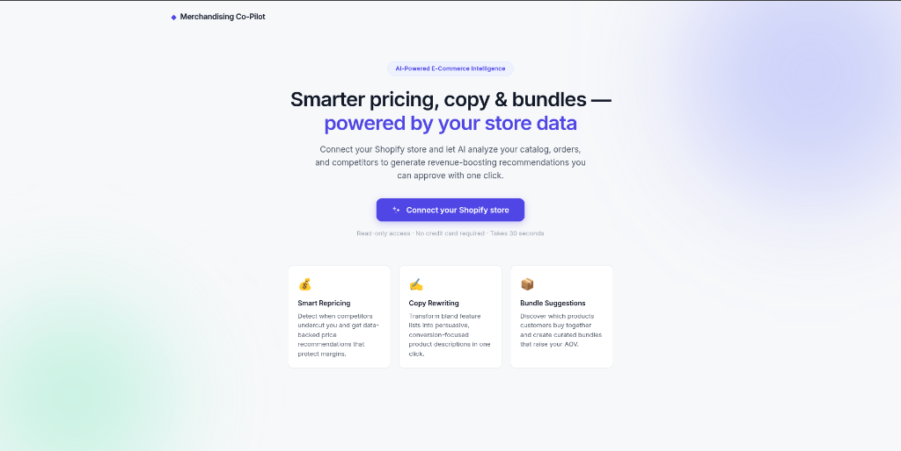
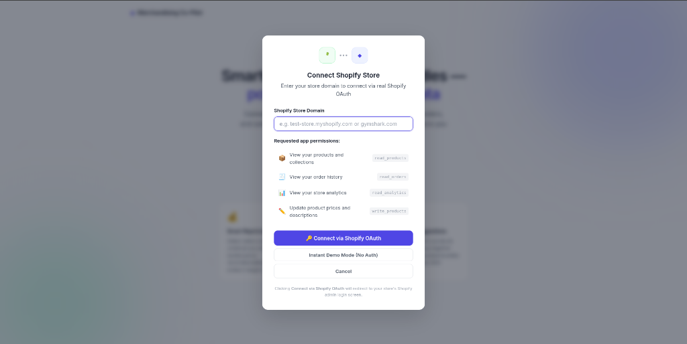
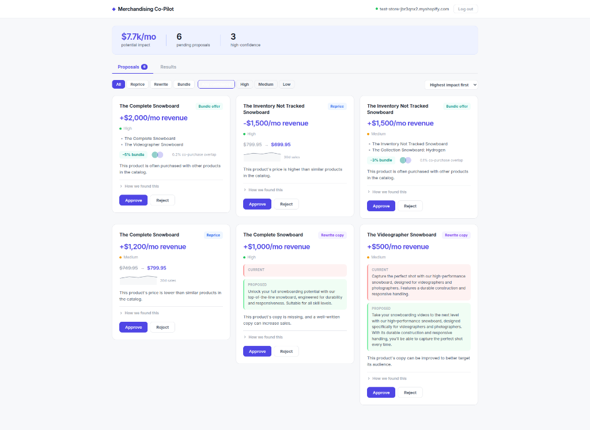
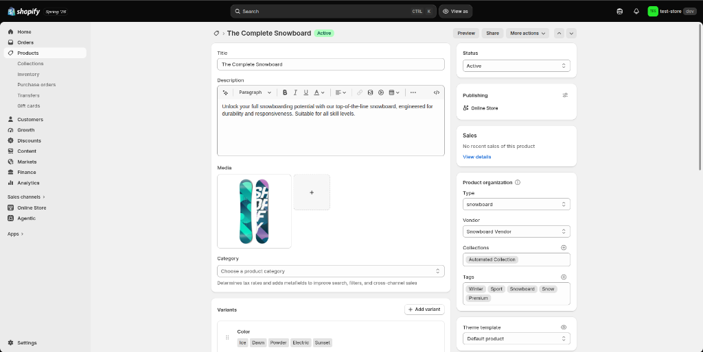
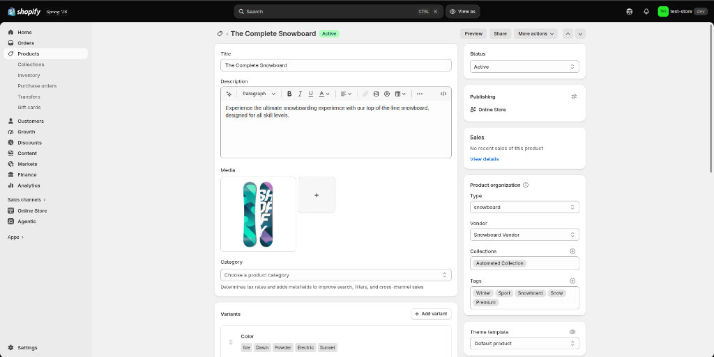

> **Your AI-Powered Smart Assistant for E-Commerce Stores** 🚀
> 
> Boost sales, save time, and grow your online store with automated recommendations for smart pricing, compelling product descriptions, and profit-boosting product bundles!

---

## 🌟 What is Merchandising Co-Pilot?

Running an online store involves hundreds of tiny decisions every day. **Merchandising Co-Pilot** acts like your personal 24/7 retail strategist. It analyzes store data and market trends to automatically generate actionable business proposals:

- 💰 **Smart Price Adjustments:** Recommends optimal product pricing based on market trends to increase sales while preserving high profit margins.
- ✍️ **AI Copy Rewriting:** Transforms plain product descriptions into persuasive, customer-focused copy that boosts conversion rates.
- 📦 **Product Bundling:** Identifies products frequently bought together and suggests discounted bundles to raise your Average Order Value (AOV).
- ⚡ **One-Click Actions:** Review data-backed proposals in a clean interactive dashboard and approve or reject them instantly!
- ↺ **Instant Rollback:** Easily revert any approved change back to its original price or description with a single click.

---

## 📸 How It Works (Step-by-Step Guide)

### Step 1: Open the App Homepage
Visit the homepage and click the **"Connect your Shopify store"** button to start connecting your store.



---

### Step 2: Connect Your Shopify Store
Enter your Shopify store URL (for example, `test-store-jbr3qnx2.myshopify.com`) and click **"Connect via Shopify OAuth"**. This securely links your store catalog and product prices.



---

### Step 3: Review AI Recommendations
Once connected, the AI analyzes your catalog products and presents 6 smart recommendations:
- **Reprice:** Adjust prices up or down to boost revenue.
- **Rewrite copy:** Replace dry bullet points with engaging marketing descriptions.
- **Bundle offer:** Group items frequently bought together to raise order value.

Click **"Approve"** to apply a recommendation directly to your live store, or **"Reject"** to skip it.



---

### Step 4: Real-Time Sync with Shopify
When you click **Approve**, the app instantly updates your actual Shopify store in real-time.

#### *Before Approval (Original Description):*


#### *After Approval (New AI Description Live on Shopify):*


---

### Step 5: Track Results & Easy Rollback
- Switch to the **Results** tab to track the live impact of your approved proposals.
- **Changed your mind?** Click the **Rollback** button on any approved card to instantly restore your store's original price or description!

*(You can attach your Results Tab screenshot here!)*

---

## Project Structure

```
merchandising-copilot/
├── backend/                 # FastAPI backend
│   ├── app/
│   │   ├── main.py          # Application entry point
│   │   ├── config.py        # Settings (pydantic-settings)
│   │   ├── models/          # Pydantic data models
│   │   ├── routes/          # API route handlers (auth, proposals, results)
│   │   └── services/        # Business logic (agent, shopify_client, scheduler)
│   ├── Dockerfile
│   └── requirements.txt
├── docs/
│   └── screenshots/         # Screenshots for documentation
├── frontend/                # React + Vite frontend
│   ├── src/
│   ├── Dockerfile
│   └── package.json
├── docker-compose.yml       # Full-stack orchestration
├── .env.example             # Environment variable template
└── README.md
```

---

## Quick Start (Docker)

### 1. Clone & configure environment

```bash
git clone <your-repo-url> merchandising-copilot
cd merchandising-copilot
cp .env.example .env        # edit .env if needed
```

### 2. Start everything

```bash
docker-compose up --build
```

This brings up three containers:

| Service      | URL                        | Description              |
| ------------ | -------------------------- | ------------------------ |
| **Backend**  | http://localhost:8000      | FastAPI (auto-reload)    |
| **Frontend** | http://localhost:5173      | Vite dev server          |
| **Postgres** | `localhost:5432`           | PostgreSQL 16            |

### 3. Verify it's running

```bash
# Health check
curl http://localhost:8000/health

# Interactive API docs
open http://localhost:8000/docs
```

### 4. Stop everything

```bash
docker-compose down          # keep data
docker-compose down -v       # remove data volumes too
```

---

## Local Development (without Docker)

### Backend

```bash
cd backend
python -m venv .venv && source .venv/bin/activate
pip install -r requirements.txt
cp ../.env.example ../.env
uvicorn app.main:app --reload --port 8000
```

### Frontend

```bash
cd frontend
npm install
npm run dev
```

---

## API Docs

Once the backend is running, visit:

- **Swagger UI** → http://localhost:8000/docs
- **ReDoc** → http://localhost:8000/redoc

---

## Environment Variables

See [`.env.example`](.env.example) for all available configuration options.

| Variable         | Default                                                     | Description               |
| ---------------- | ----------------------------------------------------------- | ------------------------- |
| `APP_NAME`       | `Merchandising Co-Pilot`                                    | Display name              |
| `DEBUG`          | `true`                                                      | Enable debug mode         |
| `DATABASE_URL`   | `postgresql+asyncpg://postgres:postgres@db:5432/merchandising` | Async Postgres DSN     |
| `SECRET_KEY`     | `change-me-in-production`                                   | App secret key            |
| `CORS_ORIGINS`   | `["http://localhost:5173"]`                                  | Allowed CORS origins      |

---

## License

MIT
